## SpringBoot


之前的web开发需要打war包，tomcat运行

SpringBoot后 打jar包，内嵌Tomcat


### SprinBoot概述

轻量级Java开发框架，解决了企业级应用开发的复杂性创建的，简化开发

+ 如何简化

  基于pojo的轻量级和最小侵入编程

  IOC

  AOP

  通过切面和模板减少样式代码 


+ SpringBoot就是一个javaweb开发框架

  + 可以用传统war包跑应用，但Boot使用jar包启动该Tomcat，就像maven整合了所有jar包，Spring Boot整合了所有的框架

  

+ 优点：
  + 更快入门Spring开发
  + 开箱即用，提供各种默认配置简化项目配置
  + 内嵌式容器简化Web项目
  + 没有冗余代码生成和xml配置的要求

### 微服务架构

论文地址：https://martinfowler.com/articles/microservices.html#CharacteristicsOfAMicroserviceArchitecture


### 创建springboot程序


官网提供了快速生成的网站，IDEA集成了它

可以i选择在官网下载后再导入IDEA开发


也可以使用IDEA创建一个springboot


  


==环境==

+ java 8
+ maven 3.6
+ SpringBoot 2.7.10


==项目结构==


pom.xml

```xml
<?xml version="1.0" encoding="UTF-8"?>
<project xmlns="http://maven.apache.org/POM/4.0.0" xmlns:xsi="http://www.w3.org/2001/XMLSchema-instance"
	xsi:schemaLocation="http://maven.apache.org/POM/4.0.0 https://maven.apache.org/xsd/maven-4.0.0.xsd">
	<modelVersion>4.0.0</modelVersion>
	<!--有一个父项目-->
	<parent>
		<groupId>org.springframework.boot</groupId>
		<artifactId>spring-boot-starter-parent</artifactId>
		<version>2.7.10</version>
		<relativePath/> <!-- lookup parent from repository -->
	</parent>
	<groupId>com.lk</groupId>
	<artifactId>Hello</artifactId>
	<version>0.0.1-SNAPSHOT</version>
	<name>Hello</name>
	<description>Demo project for Spring Boot</description>
	<properties>
		<java.version>1.8</java.version>
	</properties>
	<dependencies>
		<!--web依赖   tomcat dispacherServlet xml ...-->
		<dependency>
			<groupId>org.springframework.boot</groupId>
			<artifactId>spring-boot-starter-web</artifactId>
		</dependency>

		<!--spring-boot-starter 所有的springboot依赖都是使用这个开头的-->
		<!--单元测试-->
		<dependency>
			<groupId>org.springframework.boot</groupId>
			<artifactId>spring-boot-starter-test</artifactId>
			<scope>test</scope>
		</dependency>
	</dependencies>

	<build>
		<plugins>
			<!--打jar包插件-->
			<plugin>
				<groupId>org.springframework.boot</groupId>
				<artifactId>spring-boot-maven-plugin</artifactId>
			</plugin>
		</plugins>
	</build>

</project>
```


==编写一个http接口测试==

+ 在主程序HelloController**同级目录**下创建文件
+ 编写HelloController类

```java
//自动装配的核心原理
@RestController
public class HelloController {
    //接口：http://localhost:8080/hello
    @RequestMapping("/hello")
    //调用业务 ,接受前端的参数
    public String hello(){
        return "hello,world";
    }
}
```

+ 在主程序中启动项目，浏览器发出请求


访问**localhost:8080/hello**


#### IDEA创建springboot


==小tips==

+ sprinboot配置文件中通过 serve.port = ×××× 设置端口号


可以通过banner在线生成  修改跑主程序时候的文本图案

在配置目录下建立banner.txt ，自动识别，重启主程序，


### SpringBoot自动装配原理


#### pom.xml

通过向上寻找父项目 寻找springboot的核心依赖


当前项目pom.xml --> spring-boot-starter-parent --> spring-boot-dependencies

pom.xml中引入一些SpringBoot依赖时候，不用写依赖版本，是因为在父工程中**spring-boot-dependencies**，所有的版本都已经配置好了


#### 启动器

```
<dependency>
    <groupId>org.springframework.boot</groupId>
    <artifactId>spring-boot-starter-web</artifactId>
</dependency>
```

**spring-boot-starter-××**

说白了就是springboot的启动场景，比如spring-boot-starter-web，它会帮我们自动导入web环境所有的依赖

springboot会将所有的功能场景，都变成一个个的启动器

要使用什么功能，导入对应的启动器就好


#### 主程序

```java

//@SpringBootApplication : 标注这个类是一个springboot的应用
@SpringBootApplication
public class Springboot01HelloworldApplication {

    public static void main(String[] args) {
        //将springboot应用启动，反射方式
        SpringApplication.run(Springboot01HelloworldApplication.class, args);
    }

}
```


+  注解 @SpringBootApplication

 


```
@SpringBootConfiguration ： springboot的配置


@EnableAutoConfiguration
```

==@SpringBootConfiguration== ： springboot的配置


说明它是一个Spring配置类

==@EnableAutoConfiguration== ： 自动配置


```java
@EnableAutoConfiguration
	@AutoConfigurationPackage 自动配置包 ，下面导入了一个自动配置包
		@Import({AutoConfigurationPackages.Registrar.class})  `包注册`
		
	@Import({AutoConfigurationImportSelector.class})  ： 自动配置导入选择

//获取所有配置
 List<String> configurations = this.getCandidateConfigurations(annotationMetadata, attributes);
```


获取候选的配置

```java
protected List<String> getCandidateConfigurations(AnnotationMetadata metadata, AnnotationAttributes attributes) {
        List<String> configurations = new ArrayList(SpringFactoriesLoader.loadFactoryNames(this.getSpringFactoriesLoaderFactoryClass(), this.getBeanClassLoader()));
        ImportCandidates.load(AutoConfiguration.class, this.getBeanClassLoader()).forEach(configurations::add);
        Assert.notEmpty(configurations, "No auto configuration classes found in META-INF/spring.factories nor in META-INF/spring/org.springframework.boot.autoconfigure.AutoConfiguration.imports. If you are using a custom packaging, make sure that file is correct.");
        return configurations;
    }
```


兜兜转转 只为了把启动类下的所有资源导入

==META-INF/spring.factories==自动配置的核心文件


```
Properties properties = PropertiesLoaderUtils.loadProperties(resource);
所有的资源会加载到配置类中
```


结论：springboot所有自动配置都是在启动类中扫描并加载：**spring.factories** ，所有的自动配置类都在这里，但不一定生效，要判断条件是否成立，只要导入了对应的start，就有了对应的启动器，有了启动器，自动装配就会生效，然后配置成功


1. springboot在启动的时候，从类路径下/META-INF/spring.factories获取指定的值
2. 将这些自动配置的类导入容器，自动配置就会生效
3. 以前需要配置的东西，springboot做完了
4. 整合javaEE，解决方案和自动配置的东西都在  spring-boot-autoconfigure-2.7.10.jar 这个包下
5. 它会把所有需要导入的组件，以类名的方式返回，这些组件会被添加到容器中
6. 它会给容器中导入很多的自动配置类 （×××AutoConfiguration），就是欸容器中导入这个场景需要的所有组件，并配置好这些组件
7. 有了自动配置类，不需要再手动编写配置注入功能组件的工作


### 主启动类运行机制


直观感受，主方法开启后，启动web服务


#### run方法的执行

#### SpringApplication类

做了四件事情

+ 推断应用的类型是普通项目还是Web项目
+ 查找并加载所有可用初始化器，设置到Initializers属性中
+ 找出所有的应用程序监听器，设置到listeners属性中
+ 推断并设置main方法的定义类，找到运行的主类


### yaml语法

SpringBoot使用一个全局的配置文件，配置文件名字是固定的


+ application.properties
  + 语法结构 **key=value**
+ application.yml
  + 语法结构 **key: 空格 value**


配置文件作用：修改springboot的默认配置


yaml配置文件除了可以配普通的 key-value，还可以存对象 properties只能保存键值对

```yaml
#注意空格！

# key-value
name: li

#对象
students:
  name: lik
  age: 24


#行内写法
student: {name: lik, age: 24}

#-数组
pets:
  - cat
  - dog
  - pig
    
    
pets1: [cat,dog,pig]

#可以注入到配置类中
```

####  给属性赋值


原生的给属性赋值方式

创建一个pojo类

```java
//@Component 将该Dog类视为组件
@Component
@Data
@AllArgsConstructor
@NoArgsConstructor
public class Dog {
    @Value("lucky")
    private String name;
    @Value("4")
    private Integer age;
}
```

通过@Value 给Dog类赋值

测试输出

```java
@SpringBootTest
class Springboot02CofApplicationTests {
    @Autowired
    private Dog dog;
    @Test
    void contextLoads() {
        System.out.println(dog);
    }

}
```


**通过yml配置文件怎么给Dog赋值？**


在要赋值的pojo类增加**@ConfigurationProperties**注解


编写yaml配置文件

```yaml
person:
  name: lk
  age: 24
  happy: false
  birthday: 2022/11/20
  maps: {k1: v1,k2: v2}
  lists: [code,games]
  dog:
    name: lucky
    age: 4
```


**如何将实体类参数和yml配置文件绑定？**


绑定后就有注入的值了

测试

```java
@SpringBootTest
class Springboot02CofApplicationTests {
    @Autowired
    private Person p;
    @Test
    void contextLoads() {
        System.out.println(p);
    }

}
```


#### 给属性赋值 方式二

通过properties配置文件配置


```
@PropertySource 注解引入配置文件
```


```
//SPEL表达式取出配置文件的值
```


测试

```java
@SpringBootTest
class Springboot02CofApplicationTests {
    @Autowired
    private Person p;
    @Test
    void contextLoads() {
        System.out.println(p);
    }

}
```


另外需要注意的是，使用Properties配置，在properties中写中文会乱码，需要在IDEA中修改设置为UTF-8


|                | @ConfigrationProperties  | @Value     |
| -------------- | ------------------------ | ---------- |
| 功能           | 批量注入配置文件中的属性 | 一个个指定 |
| 松散绑定       | 支持                     | 不支持     |
| SpEL           | 不支持                   | 支持       |
| JSR303数据校验 | 支持                     | 不支持     |
| 复杂类型封装   | 支持                     | 不支持     |

松散绑定：比如yml配置文件中写的是 **last-name**,这个和lastName是一样的，后面跟着的字母是默认大写的，这就是松散绑定

#### JSR303校验

可以在字段增加一层过滤器验证，保证数据的合法性

使用 @Validated 注解进行数据校验


比如，在name属性字段要进行Email验证，添加@Email注解


注意，需要在pom.xml导入**spring-boot-starter-validation**依赖


此时名字设置的是lk，自然报错


将name属性字段改为Email格式


测试通过


@Email 源码中，有设置一个message变量，提示报错信息

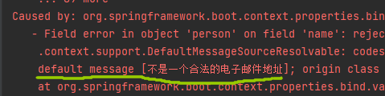

可以手动修改，


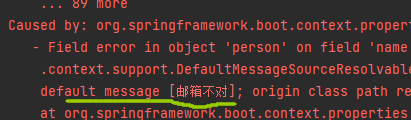


**一些JSR303的注解** 


### 配置文件位置


我可以直接在项目下新建 config目录，在目录下新建一个配置文件，也可以在当前config目录下再新建子目录，在新的子目录下导入配置文件


也可以在当前类目录路径下新建一个custom-config目录，在该目录下导入配置文件


也可以在当前类目录路径下（resources/）直接配置所需配置文件


==当多个路径下都有配置文件时，默认优先选择项目路径下/config目录下的配置文件==


### 多环境配置

当有多个环境配置文件时：


默认走第一个默认的配置文件，可以在**application.yaml** 指定配置文件


这时走的就是dev环境


也可以在一个 dpplication.yaml中创建多个环境版块，这样子就不用创建多个文件了


### 自动配置原理

在 Application.yaml 中能配置的东西，  xxxProperties 都通过 xxxAutoConfigration自动装配 ，和配置文件绑定，就可以自定义配置

1. springboot启动会加载大量的自动配置类
2. 看需要的功能有没有在springboot默认写好的自动配置类中
3. 再看这个自动配置类中配置了哪些组件；（只要组件在，就不需要手动配置）
4. 给容器中自动配置类添加组件时，会从properties类中获取某些属性，只需要在配置文件中指定这些属性的值即可


xxxAutoConfigration 自动配置类；给容器中添加组件


xxxProperties 封装配置文件中的相关属性 ，可以通过yaml配置文件手动修改再配置


==可以通过 debug = true（配置文件中配置） 来查看配置的哪些类生效哪些类没有生效==

没有生效的东西，找到它对应的start依赖导入即可


### Springboot Web开发

#### 静态资源导入


```java
@Override
public void addResourceHandlers(ResourceHandlerRegistry registry) {
if (!this.resourceProperties.isAddMappings()) {
logger.debug("Default resource handling disabled");
return;
}
addResourceHandler(registry, "/webjars/**", "classpath:/META-INF/resources/webjars/");
addResourceHandler(registry, this.mvcProperties.getStaticPathPattern(), (registration) -> {
registration.addResourceLocations(this.resourceProperties.getStaticLocations());
if (this.servletContext != null) {
ServletContextResource resource = new ServletContextResource(this.servletContext, SERVLET_LOCATION);
registration.addResourceLocations(resource);
}
});
}
```


在springboot 中，可以使用以下方式处理静态资源

+ webjars
+ public static /** resources 目录下的访问


优先级： resources > static(默认的) > public


#### 首页和图标定制

```java
private Resource getWelcomePage() {
   for (String location : this.resourceProperties.getStaticLocations()) {
      Resource indexHtml = getIndexHtml(location);
      if (indexHtml != null) {
         return indexHtml;
      }
   }
   ServletContext servletContext = getServletContext();
   if (servletContext != null) {
      return getIndexHtml(new ServletContextResource(servletContext, SERVLET_LOCATION));
   }
   return null;
}

private Resource getIndexHtml(String location) {
   return getIndexHtml(this.resourceLoader.getResource(location));
}

private Resource getIndexHtml(Resource location) {
   try {
      Resource resource = location.createRelative("index.html");
      if (resource.exists() && (resource.getURL() != null)) {
         return resource;
      }
   }
   catch (Exception ex) {
   }
   return null;
}
```


访问localhost:8080  直接默认访问到 Index.html页面


#### 模板引擎 thymeleaf


前端交给我们的页面是html页面，之前都是编写的jsp页面，jsp的好处就是当我们查出一些数据转发到JSP页面后，可以用jsp轻松实现数据的显示和交互，还包括能写java代码。现在使用springboot开发，首先是以jar包的方式，不是之前打包成war包，第二，嵌入式的使用Tomcat，所以SPringboot开发默认不支持jsp

直接使用纯静态页面的方式不可行，springboot推荐使用模板引擎 thymeleaf


导入thymeleaf依赖

```xml
<dependency>
    <groupId>org.thymeleaf</groupId>
    <artifactId>thymeleaf-spring5</artifactId>
</dependency>

<dependency>
    <groupId>org.thymeleaf.extras</groupId>
    <artifactId>thymeleaf-extras-java8time</artifactId>

</dependency>
```

模板引擎是以业务逻辑层和表现层分离为目的的，将规定格式的模板代码转换为业务数据的算法实现。

+ 它可以是一个过程代码、一个类，甚至是一个类库。不同的模板引擎其功用也不尽相同，但其基本原理都差不多。

Thymeleaf是用来开发Web和独立环境项目的服务器端的Java模版引擎

+ Spring官方支持的服务的渲染模板中，并不包含jsp。而是Thymeleaf和 Freemarker等，而Thymeleaf与SpringMVC的视图技术，及SpringBoot的 自动化配置集成非常完美，几乎没有任何成本，你只用关注Thymeleaf的语法 即可。

+ 动静结合：Thymeleaf 在有网络和无网络的环境下皆可运行，即它可以让美工在浏 览器查看页面的静态效果，也可以让程序员在服务器查看带数据的动态页面效果。这是 由于它支持 html 原型，然后在 html 标签里增加额外的属性来达到模板+数据的展示 方式。浏览器解释 html 时会忽略未定义的标签属性，所以 thymeleaf 的模板可以静态 地运行；当有数据返回到页面时，Thymeleaf 标签会动态地替换掉静态内容，使页面动 态显示。

+ 开箱即用：它提供标准和spring标准两种方言，可以直接套用模板实现JSTL、 OGNL表达式效果，避免每天套模板、该jstl、改标签的困扰。同时开发人员也可以扩展 和创建自定义的方言。

+ 多方言支持：Thymeleaf 提供spring标准方言和一个与 SpringMVC 完美集成的 可选模块，可以快速的实现表单绑定、属性编辑器、国际化等功能。

+ 与SpringBoot完美整合：SpringBoot提供了Thymeleaf的默认配置，并且 为Thymeleaf设置了视图解析器，我们可以像以前操作jsp一样来操作Thymeleaf。代 码几乎没有任何区别，就是在模板语法上有区别。


编写一个controller简单测试

```java
//在templates 目录下的所有页面，稚嫩通过Controller来跳转
//需要模板引擎的支持  thymeleaf
@Controller
public class indexController {
    @RequestMapping("/test")
    public String index(){
        return "test";
    }
}
```


https://www.thymeleaf.org/doc/tutorials/3.0/usingthymeleaf.html 官方文档


测试

```html
<!DOCTYPE html>
<html lang="en" xmlns:th="http://www.thymeleaf.org">
<head>
    <meta charset="UTF-8">
    <title>Title</title>
</head>
<body>
<!--所有的 html元素都可以被 thymeleaf替换接管 ，  th: 元素名-->
<div th:text="${msg}"></div>
<!--<h1 th:text="${msg}"></h1>-->
</body>
</html>
```

```java
//在templates 目录下的所有页面，稚嫩通过Controller来跳转
//需要模板引擎的支持  thymeleaf
@Controller
public class indexController {
    @RequestMapping("/test")
    public String test(Model model){
        model.addAttribute("msg","springboot");
        return "test";
    }
}
```


**语法**


==test & utext==

```html
<div th:text="${msg}"></div>
<!--<h1 th:text="${msg}"></h1>-->
<div th:utext="${msg}"></div>
```


==each==

```html
<h3 th:each="user:${users}" th:text="${user}"></h3>
```

... ...

### MVC配置原理

#### 自定义视图解析器


springgboot提供了自动装配功能（可以实现很多功能的自动装配），可以自定义各种功能，包括拦截器，视图解析器等，通过 创建一个类实现WebMvcConfigurer，添加上@Configuration 不添加@EnableWebMvc 注解，否则会装配默认功能

配置类一般会写在config包下

如下：


```java
//如果 需要diy一些定制化的功能 只要写这个组件，然后将他交给sprinboot，springboot帮我们自动装配
//扩展springmvc配置
@Configuration
public class MyMvcConfig implements WebMvcConfigurer {
    //public interface ViewResolver  实现了视图解析器接口的类，就可以把它看作视图解析器


    @Bean
    public ViewResolver myViewResolver(){
        return new MyViewResolver();
    }

    //定义了一个自己的视图解析器
    public static class MyViewResolver implements ViewResolver{
        @Override
        public View resolveViewName(String viewName, Locale locale) throws Exception {
            return null;
        }
    }
}

```


SpringBoot在自动配置很多组件的时候，先看容器中有没有用户自己配置的，如果有就用用户配置的，如果没有就用自动配置的；如果有些组件可以存在多个，比如我们的视图解析器，就将用户配置的和自己默认的组合起来


控制视图跳转测试

```java
@Configuration
public class MyMvcConfig implements WebMvcConfigurer {
    //public interface ViewResolver  实现了视图解析器接口的类，就可以把它看作视图解析器

    //视图跳转
    @Override
    public void addViewControllers(ViewControllerRegistry registry) {
        registry.addViewController("/lk").setViewName("test");
    }
}
```


在SpringBoot中，有非常多的  xxxx Coniguration ，帮助我们进行扩展配置，只要看见了这个东西，就要引起注意


## 员工管理系统

### 准备工作

初始化一个springboot-web项目

模拟一个数据库

**pojo类编写**

```java
//部门
@Data
@AllArgsConstructor
@NoArgsConstructor
public class Department {
    private Integer id;
    private String departmentName;
}
```

```java
@Data
@NoArgsConstructor

//员工
public class Employee {
    private Integer id;
    private String name;
    private String email;
    private Integer gender;  // 0 :女 1： 男

    private Department department;
    private Date birth;

    public Employee(Integer id, String name, String email, Integer gender, Department department, Date birth) {
        this.id = id;
        this.name = name;
        this.email = email;
        this.gender = gender;
        this.department = department;
        // 默认的创建日期
        this.birth = new Date();
    }
}
```


**dao层编写**

```java
@Repository
public class DepartmentDao {
    //模拟数据库中的数据
    private static Map<Integer, Department> departments = null;

    static {
        departments = new HashMap<Integer, Department>();  //创建一个部门表

        departments.put(101,new Department(101,"教学部"));
        departments.put(102,new Department(102,"市场部"));
        departments.put(103,new Department(103,"教研部"));
        departments.put(104,new Department(104,"运营部"));
        departments.put(105,new Department(105,"后勤部"));
    }


    //数据库的操作
    //获得所有部门信息
    public Collection<Department> getDepatments(){
        return departments.values();
    }

    //通过部门得到id
    public Department getDepartmentById(Integer id){
        return departments.get(id);
    }
}
```


==员工==

```java
//员工dao
@Repository
public class EmployeeDao {


    //模拟数据库中的数据
    private static Map<Integer, Employee> employees = null;
    // 员工有所属部门
    @Autowired
    private DepartmentDao departmentDao;
    static {
        employees = new HashMap<Integer, Employee>();  //创建一个部门表

        employees.put(101,new Employee(1,"lk",null,0,new Department(105,"后勤部"),null));
        employees.put(101,new Employee(2,"hxf",null,0,new Department(104,"运营部"),null));
        employees.put(101,new Employee(3,"zxm",null,0,new Department(103,"教研部"),null));
        employees.put(101,new Employee(4,"myn",null,0,new Department(102,"市场部"),null));
        employees.put(101,new Employee(5,"gpx",null,0,new Department(101,"教学部"),null));
    }


    //数据库的操作
    //主键自增
    private static Integer initId = 6;

    //增加员工
    public void save(Employee employee){
        if (employee.getId() == null){
            employee.setId(initId++);
        }

        employee.setDepartment(departmentDao.getDepartmentById(employee.getDepartment().getId()));

        employees.put(employee.getId(),employee);
    }

    //查看全部员工信息
    public Collection<Employee> getAll(){
        return employees.values();
    }

    //通过id查员工
    public Employee getEmployeeById(Integer id){
        return employees.get(id);
    }

    //删除员工通过id
    public void delete(Integer id){
        employees.remove(id);
    }
}
```

### 首页配置

所有的静态页面使用themleaf模板引擎，需要配置上去


MVC配置类中可以自定义配置访问路径


### 页面国际化

适配切换中英文


**国际化配置文件** — i18n


index页面绑定调用国际化配置文件参数


**自定义配置resolveLocale类**


继承实现了`LocaleResolver`接口


`AcceptHeaderLocaleResolver` 实现了`LocaleResolver`接口，`resolveLocale`方法进行判断，如果存在默认的国家地区，就走默认的，没有的话就从`request`请求中解析出国家地区


==自定义LocaleResolver==

```java
public class MyLocaleResolver implements LocaleResolver {
    @Override
    public Locale resolveLocale(HttpServletRequest request) {
        //获取请求中的语言参数
        String language = request.getParameter("language");

        System.out.println("debug===>"+ language);
        Locale locale = Locale.getDefault(); //如果没有就使用默认的
        //如果请求的连接携带了参数
        if (!StringUtils.isEmpty(language)){
            String[] split = language.split("_");
            //国家，地区
            locale = new Locale(split[0], split[1]);
        }
        return locale;

    }

    @Override
    public void setLocale(HttpServletRequest request, HttpServletResponse response, Locale locale) {

    }
}
```

从请求页面中的**language**参数解析得到要显示的语言


**MyMvcConfig中绑定注册Bean**

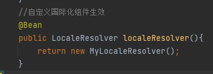


### 登录功能

需求：判断用户名和密码，登陆成功跳转到系统首页，失败则报错


首页 dashboard.css 


编写loginController

```java
@Controller
public class LoginController {
    @RequestMapping("/user/login")

    public String login(@RequestParam("username") String username, @RequestParam("password") String password, Model model){

        //具体的业务
        if (!StringUtils.isEmpty(username)&& "123456".equals(password)){
            return "redirect:/main.html";
        }else {
            //告诉用户登录失败
            model.addAttribute("msg","用户名密码错误");
            return "index";
        }

    }
}
```


一些细节：

+ 

通过 url`.../main.html`也能访问到 dashboard.css 首页

登陆成功后自动跳转的url如果不进行映射，url就会比较复杂


所以需要当登陆成功后，直接跳转到指定配置好的url `.../main.html`


+ 用户名密码验证失败后index页面提示 “用户名密码错误”，在controller中，通过model向页面传送一个 `msg`，前端显示也应该判断`msg`是否为空，如果为空，就是登陆成功或者还没有登录，这时不应该显示 `用户名密码错误`，因此有以下一段代码进行判断显示

  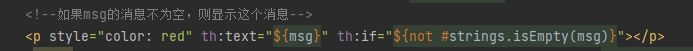

这里如果不进行判断，业务逻辑其实也说的通，这里加这个判断逻辑看起来好像是多余的，因为登陆成功直接跳转页面，而登录失败才会向页面传msg，当没有登陆失败或者没登录时，msg并不存在，页面当然也不会无缘无故显示`用户名密码错误` 


+ 目前登录的问题就是即使不登录，我直接访问也可以进入 dashboard 页面，因此要加一个登录拦截器，


### 登录拦截器

编写一个登录拦截器类

实现`HandlerInterceptor`接口，

登录成功后，会存在一个**session**，利用`session`判断是否用拦截器拦截

```java
public class LoginHandlerInterceptor implements HandlerInterceptor {
    @Override
    public boolean preHandle(HttpServletRequest request, HttpServletResponse response, Object handler) throws Exception {
        //登录成功后，应该有用户的session
        Object loginUser = request.getSession().getAttribute("loginUser");

        if (loginUser == null){
            //没有登录
            request.setAttribute("msg","没权限，请先登录");
            request.getRequestDispatcher("/index.html").forward(request,response);
            return false;
        }else {
            return true;
        }
    }


}
```


在loginController中传入session


`MyMvcConfig`中添加一个注册拦截器的方法

```java
@Override
public void addInterceptors(InterceptorRegistry registry) {
    registry.addInterceptor(new LoginHandlerInterceptor()).addPathPatterns("/**").excludePathPatterns("/index.html","/","/user/login","/css/*","/js/**","/img/**");
}
```


### 展示员工列表（查）


前端几个注意点：

+ 红色标签属于公共部分，可以用`th:fragment`将每一块抽取出来，当作独立的组件，然后再用`th:replace`标签调用组件。公共部分可以另外单独写一个`commons.html`文件，这样前端代码量会小很多
+ 

+ ②部分，应该实现点那个标签哪个标签高亮，这就需要添加一个判断：

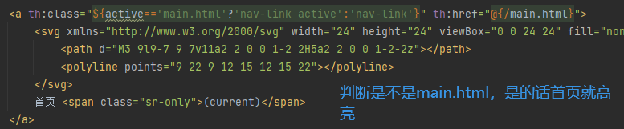


+ 显示员工列表部分，

  

上边是头部，下边是主体部分，性别显示加一个判断就好


**EmployeeController编写**

```java
@Controller
public class EmployeeController {
    @Autowired
    EmployeeDao employeeDao;
    @RequestMapping("/emps")
    public String list(Model model){
        Collection<Employee> employees = employeeDao.getAll();
        model.addAttribute("emps",employees);
        return "/emp/list";

    }
}
```

### 添加员工


员工展示页面，左上角添加一个 `添加员工`按钮，点击跳转到增加员工信息页面，post方法提交


```java
@PostMapping("/emp")
public String addEmp(Employee employee){
    System.out.println("save =>" + employee);

    //添加的操作 forward
    employeeDao.save(employee); //调用底层业务方法保存员工信息
    return "redirect:/emps";
}
```

### 修改员工信息

```java
//去员工的修改页面
@GetMapping("/emp/{id}")
public String toUpdateEmp(@PathVariable("id") Integer id, Model model){
    //查出原来的数据
    Employee employee = employeeDao.getEmployeeById(id);
    model.addAttribute("emp",employee);
    //查出所有部门的信息
    Collection<Department> depatments = departmentDao.getDepatments();
    model.addAttribute("departments",depatments);
    return "emp/update";

}
@PostMapping("/updateEmp")
public String updateEmp(Employee employee){
    System.out.println("update==>"+ employee);
    employeeDao.save(employee);
    return "redirect:/emps";
}
```

### 删除员工

```java
//删除员工
@GetMapping("/delemp/{id}")
public String deleteEmp(@PathVariable("id") int id){
    employeeDao.delete(id);
    return "redirect:/emps";
}
```


==404处理和注销==

springboot中直接再/tmplates/error下写404.html就可以，报错404时，直接跳转到该页面


注销的controller: 无非就是清楚session 然后跳转到登录i页面

```java
    //注销
    @RequestMapping("/user/logout")
    public String logout(HttpSession session){
        session.invalidate();
        return "redirect:/index.html";
    }
}
```


### 整合JDBC

引入jdbc依赖

```xml
<!--JDBC-->
<dependency>
    <groupId>org.springframework.boot</groupId>
    <artifactId>spring-boot-starter-jdbc</artifactId>
</dependency>
```


编写配置文件 `application.yaml`，连接数据库

```java
spring:
  datasource:
    username: root
    password: root
    # 假如时区报错，增加一个时区的配置就Ok 了  serverTimezone=UTC
    url: jdbc:mysql://localhost:3306/mybatis?userUnicode=true&characterEncoding=utf-8
    driver-class-name: com.mysql.cj.jdbc.Driver
```

SpringBoot已经默认自动配置

编写一个测试类

```java
@SpringBootTest
class Springboot04DateApplicationTests {
    @Autowired
    DataSource dataSource;
    @Test
    void contextLoads() throws SQLException {
        //查看以下默认的数据源  class com.zaxxer.hikari.HikariDataSource
        System.out.println(dataSource.getClass());


        //获得数据库连接
        Connection connection = dataSource.getConnection();
        System.out.println(connection);

        //  xxxxTemplate : springboot 已经配置好的模板bean ，拿来即用
        connection.close();
    }

}
```

测试输出 默认的数据源是`hikari`

可以通过源码看到， `DataSourceAutoConfiguration.java`类中配置的自动导入hikari

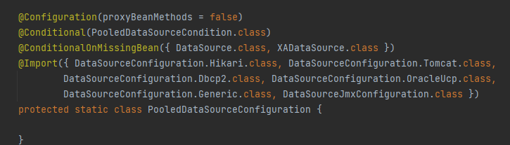


Hikari 被称为javaWeb当前速度最快的数据源


但然，也可以在配置文件中手动配置其他数据源

> JDBCTemplate

1、有了数据源(com.zaxxer.hikari.HikariDataSource)，然后可以拿到数据库连接(java.sql.Connection)，有了连接，就可以使用原生的 JDBC 语句来操作数据库；

2、即使不使用第三方第数据库操作框架，如 MyBatis等，Spring 本身也对原生的JDBC 做了轻量级的封装，即JdbcTemplate。

3、数据库操作的所有 CRUD 方法都在 JdbcTemplate 中。

4、Spring Boot 不仅提供了默认的数据源，同时默认已经配置好了 JdbcTemplate 放在了容器中，程序员只需自己注入即可使用

5、JdbcTemplate 的自动配置是依赖 org.springframework.boot.autoconfigure.jdbc 包下的 JdbcTemplateConfiguration 类

```java
@RestController
public class JDBCController {
    @Autowired
    JdbcTemplate jdbcTemplate;

    //查询数据库的所有信息
    //没有实体类，数据库中的东西怎么获取？ Map
    @GetMapping("/userlist")
    public List<Map<String, Object>> userlist(){
        String sql = "select * from mybatis.user";
        List<Map<String, Object>> maps = jdbcTemplate.queryForList(sql);
        return maps;
    }
    @GetMapping("/addUser")
    public String addUser(){
        String sql = "insert into mybatis.user(id,name,pwd) values (8,'hxd','122345')";
        jdbcTemplate.update(sql);
        return "update-ok";
    }

    @GetMapping("/updateUser/{id}")
    public String updateUser(@PathVariable("id") int id){
        String sql = "update mybatis.user set name = ?,pwd = ? where id =" + id;

        //封装
        Object[] objects = new Object[2];
        objects[0]  = "小鸣2";
        objects[1] = "cxsfv";
        jdbcTemplate.update(sql,objects);
        return "update ok";

    }


}
```


### 整合Druid

在配置文件`application.yaml`中手动配置其他数据源


去编写一个测试类，测试数据源是否配置成功

```java
@SpringBootTest
class Springboot04DateApplicationTests {
    @Autowired
    DataSource dataSource;
    @Test
    void contextLoads() throws SQLException {
        //查看以下默认的数据源  class com.zaxxer.hikari.HikariDataSource
        System.out.println(dataSource.getClass());


        //获得数据库连接
        Connection connection = dataSource.getConnection();
        System.out.println(connection);

        //  xxxxTemplate : springboot 已经配置好的模板bean ，拿来即用
        connection.close();
    }

}
```

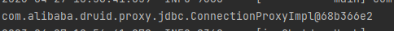


Druid其他参数配置Springboot是需要手动配置的

```xml
#Spring Boot 默认是不注入这些属性值的，需要自己绑定
#druid 数据源专有配置


initialSize: 5
minIdle: 5
maxActive: 20
maxWait: 60000
timeBetweenEvictionRunsMillis: 60000
minEvictableIdleTimeMillis: 300000
validationQuery: SELECT 1 FROM DUAL
testWhileIdle: true
testOnBorrow: false
testOnReturn: false
poolPreparedStatements: true

#配置监控统计拦截的filters，stat:监控统计、log4j：日志记录、wall：防御sql注入
#如果允许时报错  java.lang.ClassNotFoundException: org.apache.log4j.Priority
#则导入 log4j 依赖即可，Maven 地址：https://mvnrepository.com/artifact/log4j/log4j

filters: stat,wall,log4j
maxPoolPreparedStatementPerConnectionSize: 20
useGlobalDataSourceStat: true
connectionProperties: druid.stat.mergeSql=true;druid.stat.slowSqlMillis=500
```


Druid其他功能：**后台监控**&**过滤器**

```java
@Configuration
public class DruidConfig {
    @Bean
    @ConfigurationProperties(prefix = "spring.datasource")
    public DataSource druidDataSource(){
        return new DruidDataSource();
    }

    //后台监控 相当于web.xml，ServletRegistrationBean
    //因为Springboot内置了servlet容器，所以没有web.xml，替代方法： ServletRegistrationBean
    @Bean
    public ServletRegistrationBean statViewServlet(){
        ServletRegistrationBean<StatViewServlet> bean = new ServletRegistrationBean<>(new StatViewServlet(), "/druid/*");
        //后台需要有人登录，
        HashMap<String, String> initParameters = new HashMap<>();
        //增加配置
        initParameters.put("loginUsername","admin");  //登录key是固定的 loginUsername loginPassword
        initParameters.put("loginPassword","123456");

        //允许谁可以访问
        initParameters.put("allow","");
        bean.setInitParameters(initParameters);  //设置初始化参数
        return bean;


    }

    //filter
    public FilterRegistrationBean webStartFiler(){
        FilterRegistrationBean bean = new FilterRegistrationBean();

        bean.setFilter(new WebStatFilter());

        //可以过滤哪些请求
        HashMap<String,String> initParameters = new HashMap<>();

        //以下东西不进行统计
        initParameters.put("exclusions","*.js,*.css,/druid/*");
        bean.setInitParameters(initParameters);
        return bean;
    }

}
```

通过访问 `localhost:8080/druid`(这个是在写`DruidConfig`时设置的)

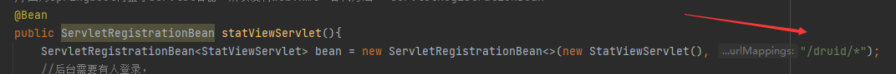


进入监控后台

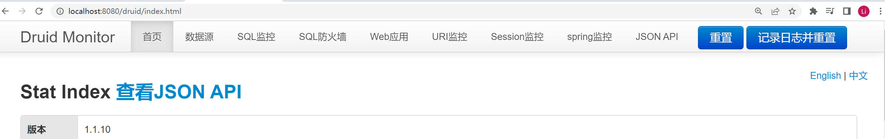

执行sql语句，可以在SQL监控中清楚看到执行日志


### 整合mybatis

**导入依赖**

```xml
<dependency>
    <groupId>org.mybatis.spring.boot</groupId>
    <artifactId>mybatis-spring-boot-starter</artifactId>
    <version>2.1.3</version>
</dependency>
```


**配合数据库连接信息**

```properties
spring.datasource.username=root
spring.datasource.password=root
spring.datasource.url=jdbc:mysql://localhost:3306/mybatis?userUnicode=true&characterEncoding=utf-8
spring.datasource.driver-class-name=com.mysql.cj.jdbc.Driver
```


**编写pojo**

```java
@Data
@NoArgsConstructor
@AllArgsConstructor
public class User {
    private int id;

    private String name;

    private String pwd;
}
```

**编写mapper**

```java
@Mapper
//这个注解表示了这时一个mybatis Mapper类
@Repository
public interface UserMapper {
    List<User> queryUserList();

    User queryUserById(int id);

    int addUser(User user);

    int updateUser(User user);

    int deleteUser(int id);
}
```

**对应的mapper.xml**

```xml
<?xml version="1.0" encoding="UTF-8" ?>
<!DOCTYPE mapper
        PUBLIC "-//mybatis.org//DTD Mapper 3.0//EN"
        "https://mybatis.org/dtd/mybatis-3-mapper.dtd">
<mapper namespace="com.lk.mapper.UserMapper">
    <select id="queryUserList" resultType="User">
        select * from mybatis.user;
    </select>
    <select id="queryUserById" resultType="User">
        select * from mybatis.user where id = #{id}
    </select>
    <insert id="addUser" parameterType="User">
        insert into mybatis.user (id, name, pwd) VALUES (#{id},#{name},#{pwd})
    </insert>
    <update id="updateUser" parameterType="User">
        update mybatis.user set name=#{name},pwd=#{pwd} where id = #{id}
    </update>
    <delete id="deleteUser" parameterType="int">
        delete from mybatis.user where id = #{id}
    </delete>

</mapper>
```


**编写Controller**

```java
@RestController
public class UserController {
    @Autowired
    private UserMapper userMapper;
    @GetMapping("/queryUserList")
    public List<User> queryUserList(){
        List<User> userList = userMapper.queryUserList();
        for (User user : userList) {
            System.out.println(user);
        }
        return userList;
    }
    @GetMapping("/queryUserById")
    public User queryUserById(int id){
        User user = userMapper.queryUserById(id);
        return user;
    }
    @GetMapping("/addUser")
    public String addUser(){
        userMapper.addUser(new User(9,"yyz","1234"));
        return  "ok";
    }
    @GetMapping("/updateUser")
    public String updateUser(){
        userMapper.updateUser(new User(9,"yyx","123444"));
        return "ok";
    }
    @GetMapping("/deleteUser")
    public String deleteUser(){
        userMapper.deleteUser(9);
        return "ok";
    }

}
```


## SpringSecurity

过滤器 拦截器等


两个安全框架 shiro  SpringSecurity

一个认证 一个授权


### 环境搭建

新建一个springboot web项目，

导入静态资源

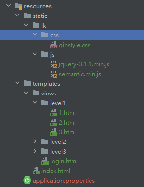

编写一个controller去控制页面跳转访问资源‘

```java
@Controller
public class RouterController {
    @RequestMapping({"/" , "/index"})
    public String index(){
        return "index";

    }
    @RequestMapping("/toLogin")
    public String toLogin(){
        return "views/lonin";

    }

    @RequestMapping("/level1/{id}")
    public String level1(@PathVariable("id") int id){
        return "views/level1/"+id;
    }

    @RequestMapping("/level2/{id}")
    public String level2(@PathVariable("id") int id){
        return "views/level2/"+id;

    }

    @RequestMapping("/level3/{id}")
    public String level3(@PathVariable("id") int id){
        return "views/level3/"+id;

    }
}
```


访问测试看页面效果

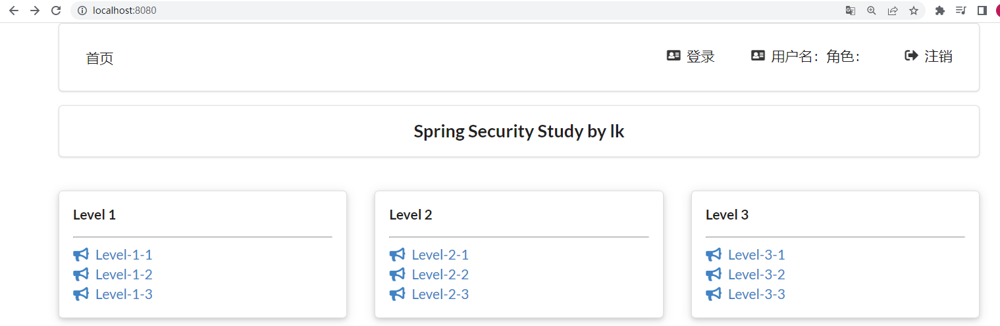


### 用户认证和授权

AOP 横切的思想去实现授权认证

Spring Security 是针对Spring项目的安全框架，也是Spring Boot底层安全模块默认的技术选型，他可以实现强大的Web安全控制，对于安全控制，我们仅需要引入 spring-boot-starter-security 模块，进行少量的配置，即可实现强大的安全管理！

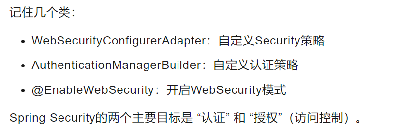


==导依赖包==

```xml
<dependency>
    <groupId>org.springframework.boot</groupId>
    <artifactId>spring-boot-starter-security</artifactId>
</dependency>
```

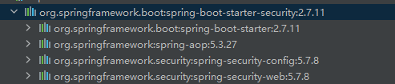


6.0.3版本的Security

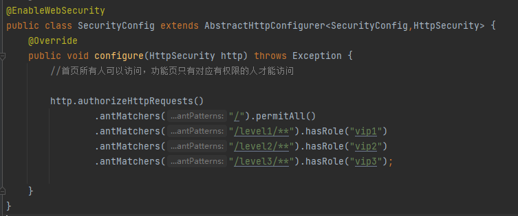

自定义一个Config  继承重写后，访问页面直接跳到登陆页面，在这之前并没有设置登录请求验证，如何解决？


先按照视频中的来，后面真正做项目需要用到时再仔细看文档


视频中版本

```java
@EnableWebSecurity
public class SecurityConfig extends WebSecurityConfigurerAdapter {
    @Override
    public void configure(HttpSecurity http) throws Exception {
        //首页所有人可以访问，功能页只有对应有权限的人才能访问
		//请求授权的规则
        http.authorizeHttpRequests()
                .antMatchers("/").permitAll()
                .antMatchers("/level1/**").hasRole("vip1")
                .antMatchers("/level2/**").hasRole("vip2")
                .antMatchers("/level3/**").hasRole("vip3");

    }
}
```

点击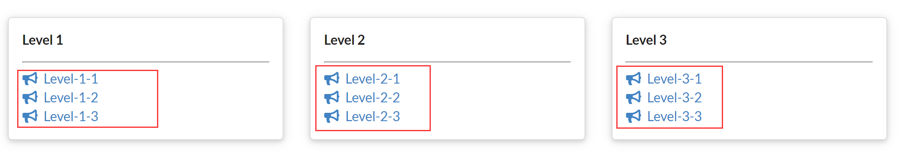

这些表单，会报403错误

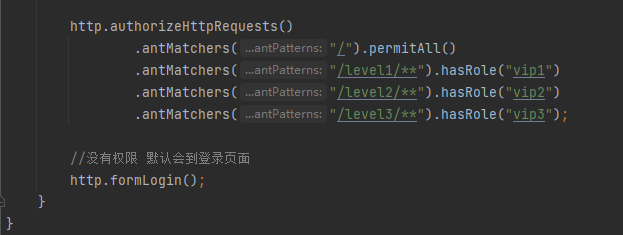

没有权限会自动跳到login页面，但是之前并没有去配置login'页面，  `http.formlogin`做了这件事情 

为什么会跳到login页面 -->看源码

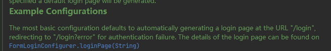


**测试认证**

```java
@EnableWebSecurity
public class SecurityConfig extends WebSecurityConfigurerAdapter {
    //授权
    @Override
    public void configure(HttpSecurity http) throws Exception {
        //首页所有人可以访问，功能页只有对应有权限的人才能访问

        http.authorizeHttpRequests()
                .antMatchers("/").permitAll()
                .antMatchers("/level1/**").hasRole("vip1")
                .antMatchers("/level2/**").hasRole("vip2")
                .antMatchers("/level3/**").hasRole("vip3");

        //没有权限 默认会到登录页面
        http.formLogin();
    }
    //认证
    //在Spring Security5.0+ 中，新增了很多加密方法
    @Override
    protected void configure(AuthenticationManagerBuilder auth) throws Exception {
        //这些数据正常应该从数据库中读
        auth.inMemoryAuthentication().passwordEncoder(new BCryptPasswordEncoder())
                .withUser("lk").password(new BCryptPasswordEncoder().encode("123456")).roles("vip2","vip3")
                .and()
                .withUser("root").password(new BCryptPasswordEncoder().encode("123456")).roles("vip1","vip2","vip3");
    }
}
```


通过用户 `lk 123456`登录后，由于只认证了 "vip3"和"vip2"，因此 只能访问`/level3/*` 和 `/level2/*`下的页面 ，访问 `/level3/*`仍会报403错误，但是`root`用户有`vip1`权限，因此`root`用户可以访问 `/level1/*`


### 注销及权限控制

注销功能实现很简单：

```java
//注销
http.logout().deleteCookies("remove").invalidateHttpSession(true).logoutSuccessUrl("/");
```

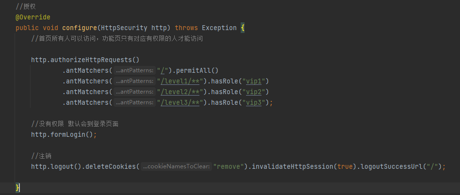

注销后自动给跳转到首页


登录后进入首页，如`lk`用户进入首页，仍会看到vip1的内容，如何实现用户登录后只能看到自己应该看到的内容？

通过 thymleaf-security的整合依赖包在`index.html`中实现

导入依赖

```java
<dependency>
    <groupId>org.thymeleaf.extras</groupId>
    <artifactId>thymeleaf-extras-springsecurity5</artifactId>
    <version>3.0.4.RELEASE</version>
</dependency>
```


以下代码实现了所需功能

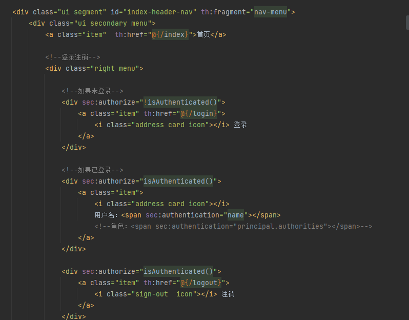


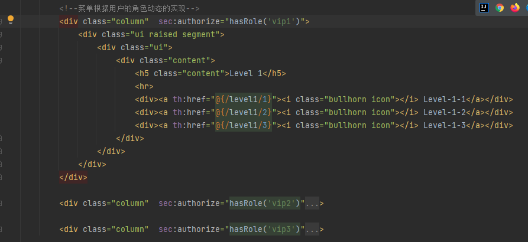


### 记住我和首页定制

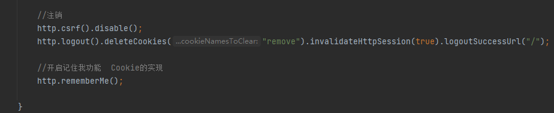


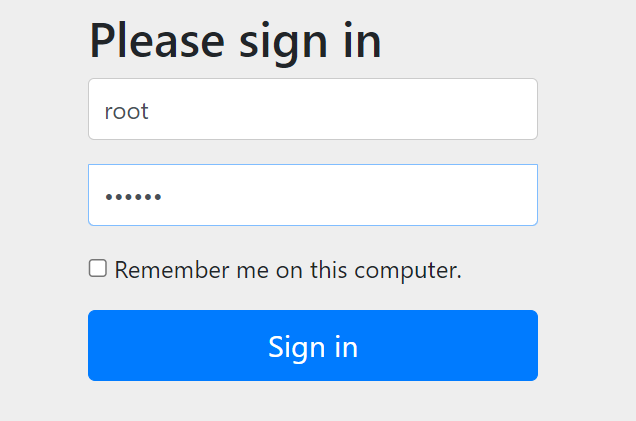

勾选后关掉页面再次进入`localhost:8080`页面，直接登录上次登录的用户

检查页面`cookie`可以看到，上次登录的用户

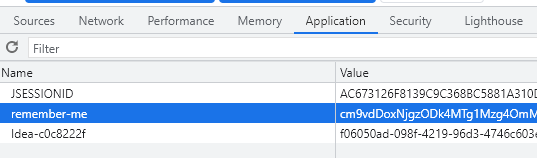

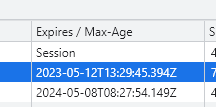

这个方法产生的cookie默认保存两周


另外就是，登录页面是源码中默认提供的`/login` ，如果自己写了一个登陆页面，点击登录跳转到自己的登陆页面，

就需要另外设置跳转的页面

如之前编写了`Controller`

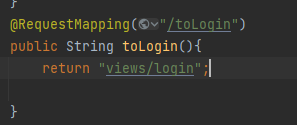

要实现登录跳转到`/toLogin`访问views目录下的`login.html`

```java
//没有权限 默认会到登录页面，如果想跳转到自己设计的登录页面，需要设置一下
http.formLogin().loginPage("/toLogin").usernameParameter("user").passwordParameter("pwd").loginProcessingUrl("/login");
```

额外设置参数就行，需要注意的就是前后端接收传递的参数名称需要一致，源码注释了默认的用户名和密码参数，如下

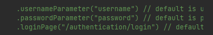

设置成user 和 pwd 后，页面传递的参数就需要写成对应的，而不能再写成 username 和 password了


`login.html`中

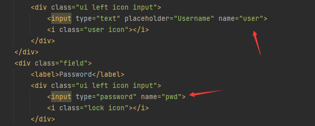


同样的道理，在登陆页面的`记住我`功能按钮，也需要另外设置前后端传递的参数名字

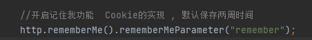

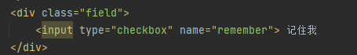


`http.formLogin().loginProcessingUrl()`设置了登录页面的url处理，之前设置了登陆页面为`/toLogin`，因此编写的页面需要action跳转的页面参数也是`/toLogin`,如果想要替换之前的`/login`就需要另外如此设置

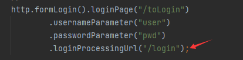

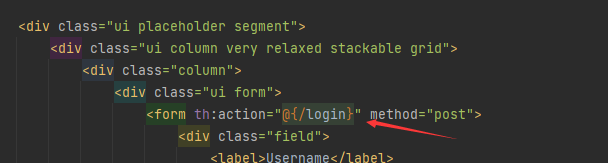

登录页面也一样对应上

访问的时候url还是/toLogin ,这个url参数处理只是为了前后端对应上


## Shiro

官网：https://shiro.apache.org/

### 简介

==什么是shiro==

`Shiro`是一个功能强大且易于使用的Java安全框架，它执行身份验证、授权、加密和会话管理。使用Shiro易于理解的API，您可以快速轻松地保护任何应用程序—从最小的移动应用程序到最大的web和企业应用程序

==核心架构==

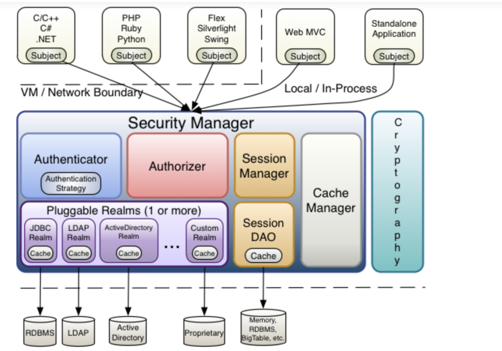

+ `Subject`即主体，外部应用与subject进行交互，subject记录了当前的操作用户，将用户的概念理解为当前操作的主体。外部程序通过subject进行认证授权，而subject是通过SecurityManager安全管理器进行认证授权

+ `SecurityManager`即安全管理器，对全部的subject进行安全管理，它是shiro的核心，负责对所有的subject进行安全管理。通过SecurityManager可以完成subject的认证、授权等，实质上SecurityManager是通过Authenticator进行认证，通过Authorizer进行授权，通过SessionManager进行会话管理等

  `SecurityManager`是一个接口，继承了Authenticator, Authorizer, SessionManager这三个接口

+ `Authenticator`即认证器，对用户身份进行认证，Authenticator是一个接口，shiro提供ModularRealmAuthenticator实现类，通过ModularRealmAuthenticator基本上可以满足大多数需求，也可以自定义认证器

+ `Authorizer`即授权器，用户通过认证器认证通过，在访问功能时需要通过授权器判断用户是否有此功能的操作权限

+ `Realm`即领域，相当于datasource数据源，securityManager进行安全认证需要通过Realm获取用户权限数据，比如：如果用户身份数据在数据库那么realm就需要从数据库获取用户身份信息

  ==不要把realm理解成只是从数据源取数据，在realm中还有认证授权校验的相关代码==

+ `sessionManager`即会话管理，shiro框架定义了一套会话管理，它不依赖web容器的[session](https://so.csdn.net/so/search?q=session&spm=1001.2101.3001.7020)，所以shiro可以使用在非web应用上，也可以将分布式应用的会话集中在一点管理，此特性可使它实现单点登录
+ `SessionDAO`即会话dao，是对session会话操作的一套接口，比如要将session存储到数据库，可以通过jdbc将会话存储到数据库
+ `CacheManager`即缓存管理，将用户权限数据存储在缓存，这样可以提高性能
+ `Cryptography`即密码管理，shiro提供了一套加密/解密的组件，方便开发。比如提供常用的散列、加/解密等功能。


